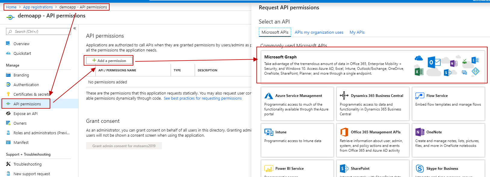
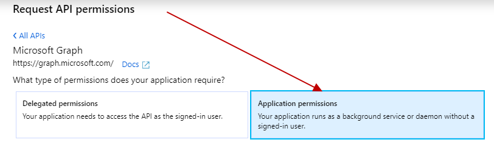
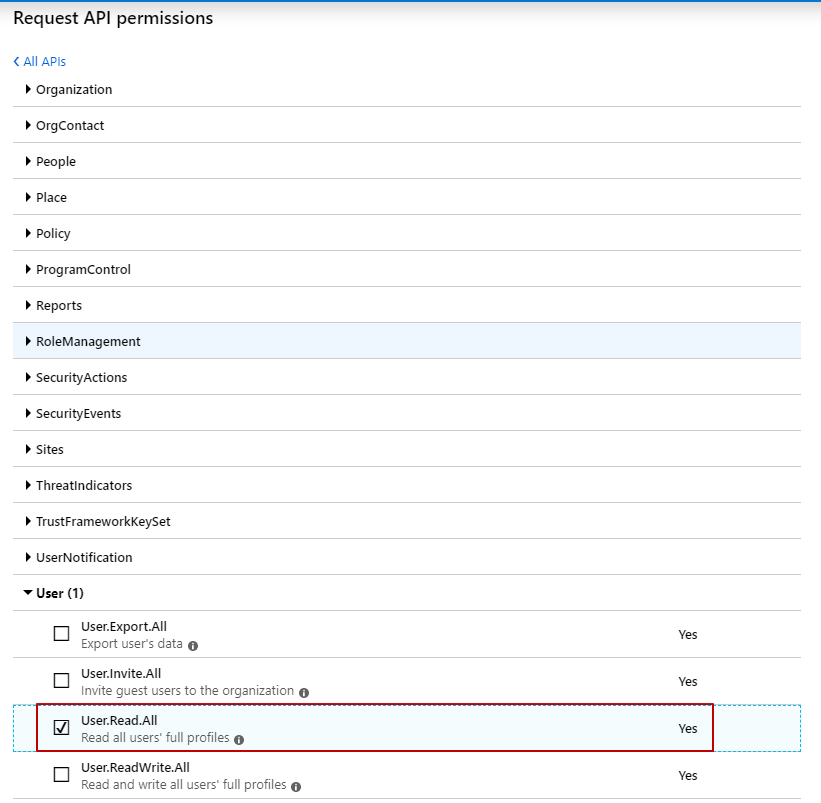
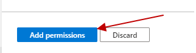
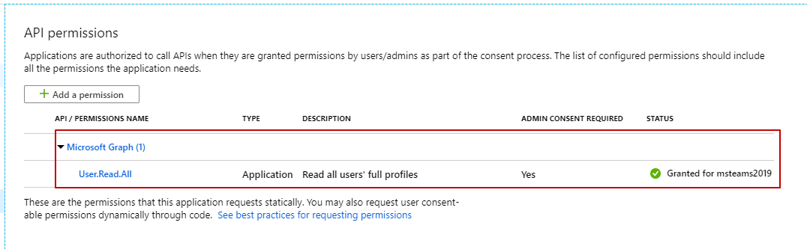

@@ -0,0 +1,51 @@
---
layout: post
title: 如何为Teams里的Bot申请权限？
---

在Teams里需要开发一款App，如果用到了Bot(Message Extension)，那就需要在[azure portal](https://portal.azure.com/#blade/Microsoft_AAD_RegisteredApps/ApplicationsListBlade)创建自己的Application了，创建完了就可以写自己的Bot Application的Menifest.json文件了。

当然，如果直接在Teams里的App Studio里创建也行，回过头来再在azure portal里编辑权限/icon相关。

实际上bot不需要额外设置。但是如果需要通过Bot来调用 [Microsoft Graph API for Teams](https://docs.microsoft.com/en-us/graph/api/resources/teams-api-overview?view=graph-rest-1.0)，那么就需要设置相应权限了。

本文我们就以获取用户信息为例，看看如何设置Application的权限。

首先通过上述链接（我们假设已经创建了Bot对应的应用了）打开Azure Portal，在这里进行应用权限的设置。【或者在Azure Portal里搜索App Registrations】

以上会打开应用权限界面：API permissions -> Add a permission -> Microsoft Graph。
选择Application permissions。此时会打开选择Application permission的界面。

这里先简单说一下Delegated permissions和Application permissions的区别，如果有机会，后边再新开一篇文章来专门介绍这块内容。

*	Delegated Permissions：

	代表用户来进行数据交互（Delegated的意思）。
	
*	Application Permissions
	当用到client-credential flow (也叫“app only flow”)，这种情况下，是没在用户的上下文中的，当作后台服务来运行。

打开Application permissions后，我们会发现一系列的权限。

因为要访问用户的profile数据，本示例我们选择User -> User.Read.All。
如果还需要其他权限，也可以在这里选择。

选择完应用所需的权限后，点击下方的蓝色按钮“Add permissions”进行保存。
。

保存完成以后，刚才加的权限会展示在API permissions下。
。

以上就是为Teams中Bot的应用添加所需权限的步骤。

如果需要查看已有Teams提供的Graph API列表，请参考[https://docs.microsoft.com/en-us/graph/api/resources/teams-api-overview?view=graph-rest-1.0](https://docs.microsoft.com/en-us/graph/api/resources/teams-api-overview?view=graph-rest-1.0)