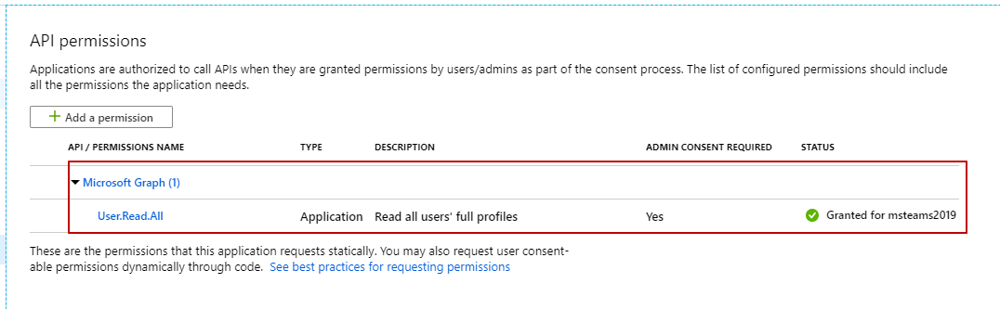
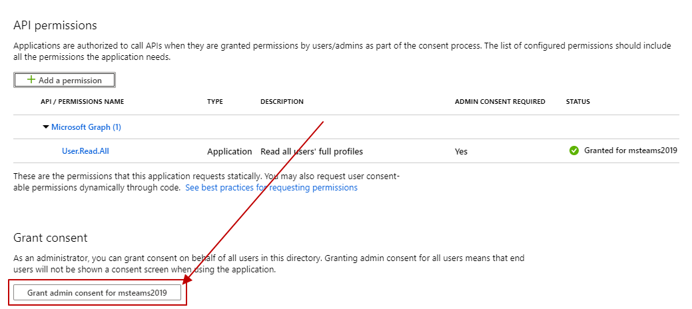
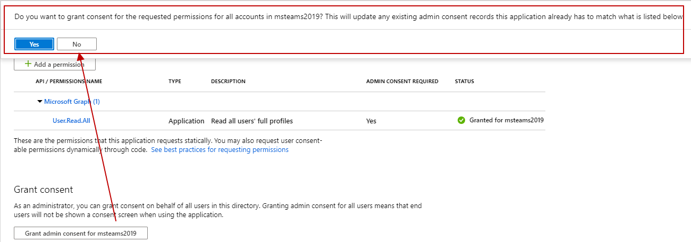
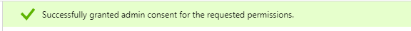
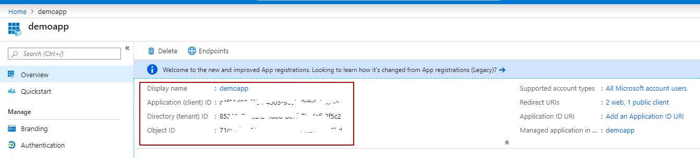
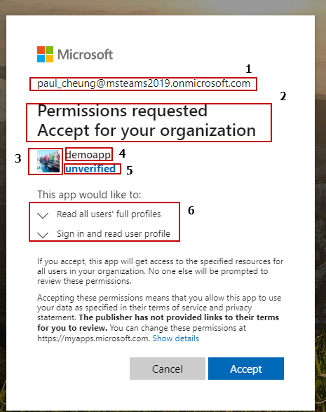

在上篇文章 [permissions for teams bot application](https://paul-cheung.github.io/permissions-for-teams-bot-application/)里讲到了，如果Teams里的Bot需要权限，我们怎样为应用添加权限，步骤也很简单。

那么添加完权限以后就大功告成了么？其实不然。

如果大家是Developer，那么很容易想到的问题就是，有权限就会有权限提升的概念。我申请了权限，很多时候不能直接用，而是需要管理员同意后才能正常使用。

Azure里的App其实也是类似的概念，当添加完应用的权限后，也会有个权限提升的过程。这篇文章就跟大家简单介绍一下怎样提升权限，有哪些方法。

当我们添加完应用权限后，在API permission页面会展示出已经添加的权限，如下图：


如果上一篇文章，大家按照步骤来做了，细心的童鞋会发现下部分有个按钮，其实就是做权限提升的（这里留个悬念，自己可以去看看，不要往下看，哈哈哈）。


点击下方的按钮，则会弹出提示框，如下：


继续点击Yes，这时候权限提升已经好了，等待处理完就会有消息提示。


以上是在Azure Portal上操作权限提示，那么还有一种是给注册体验提供的方式。即，如果在代码中生成一个url给有管理员权限的用户去操作（也就是这里Grant按钮的作用），那么该如何拼接呢？展示出来是什么样的呢？

格式如下：
```
https://login.microsoftonline.com/{tenant-id}/adminconsent?client_id={client-id}&state={random-string}&redirect_uri={redirect-url}
```

这里的tenant-id和client-id以及redirect-url在哪儿可以找到呢？


tenant-id也就是Directory ID。

client-id也就是Application ID。

redirect-url可以在右边的Redirect URLs里进行设置，当管理员通过上述链接打开页面，点击同意后会跳转到的一个url地址。

random-string是一串随机字符串，用于跳转后验证（生成链接时保存起来，再重定向到redirect-url后可以进行验证）。

再来看下，生成的链接在浏览器中打开是什么样的。


解释：

1. 发起权限提升请求的账号。
2. 标题，视情况而变化。如果是用户权限，则为“Permissions requested”。如果是管理员权限，则会有额外的一行“Accept for your organization”。
3. app的icon，可以在portal里设置。
4. app的名称。
5. app的publisher信息，当publisher为已经认证过的，那么这里会显示出来。因为我的域还没有被认证，所以这里是unverified（貌似2019-5月之前注册的不会显示这个，后边注册的会显示，有兴趣的童鞋可以去查查看）。
6. 权限列表，下拉可以打开查看详细信息。

当程序中生成这个url后，具有管理员权限的用户打开这个链接，就会看到类似于这样的页面，点击accept后。会跳转到redirect-url对应的页面。这个redirect-url不一定必须得host在什么地方。

下次有机会再跟大家分享一下unverified这块的知识。