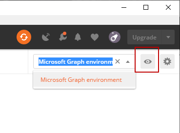
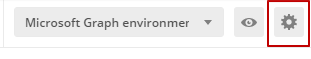
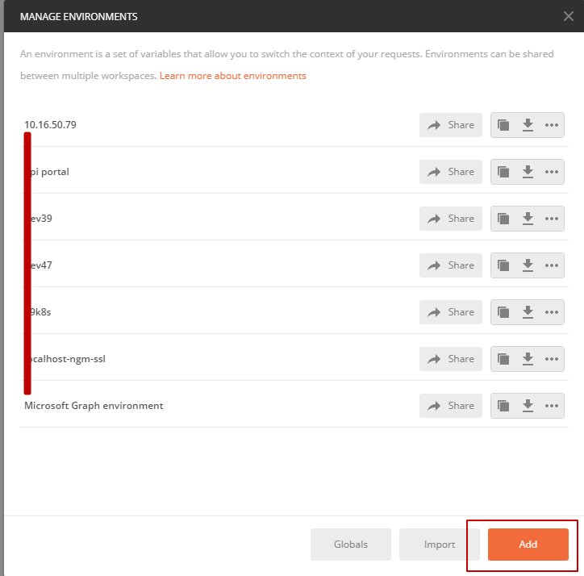
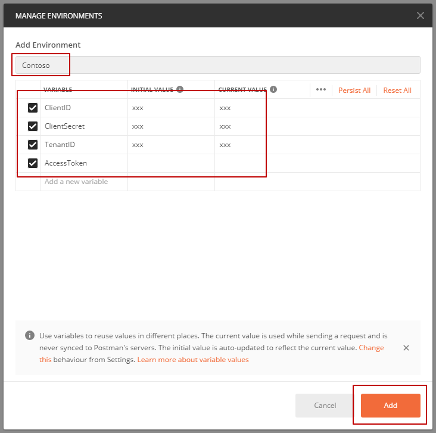
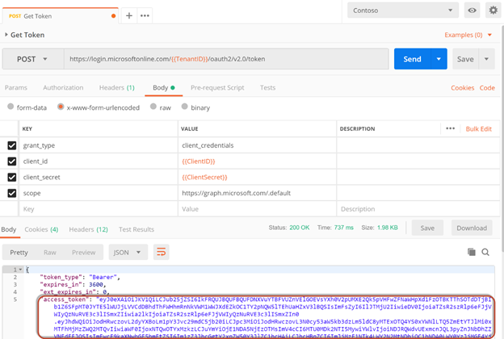
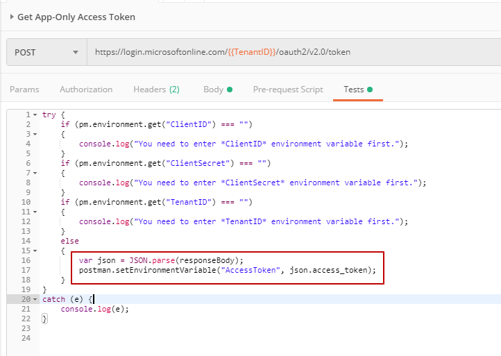
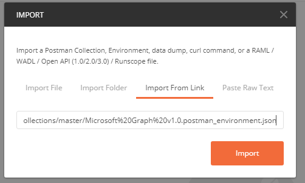

搞开发的童鞋都知道fiddler或者Postman，都是快速测试API的工具。在这篇文章里，跟大家简单介绍一下如何用它来调用Microsoft Graph的API（OAuth 2.0 app-only）。

### 条件
请确保电脑上已经安装Postman软件，或者使用在线的[Postman](https://www.getpostman.com/collections/d89a737b5f0c0825898a)，本文以桌面软件为例。  
如果使用在线版本，局部可能有点不一样，自行注意。


这里我们使用Azure AD V2.0，大概包含以下：

* 注册APP，大家可以参考这篇[博客](https://developer.microsoft.com/en-us/identity/blogs/new-app-registrations-experience-is-now-generally-available/)进行操作。
* 权限提升，参考之前的[这篇文章](https://paul-cheung.github.io/admin-consent-for-teams-bot-application/)
* 获取AccessToken
* 发送Microsoft Graph API请求（把AccessToken当作bearer token）

上述前两条请直接跳到对应博客参考。

这里我们着重看后两条。
## 获取Access Token
Postman可以存储一系列变量（global/environment based），这里我们可以将ClientID（Application ID）、Tenant ID（Directory ID）、Secret以及调用接口所用到的AccessToken都存在这里，以便在每个用到这些数据的地方统一参数化使用，这个对我们开发的工作来说很有用。

如果需要创建变量，点击右上角眼睛图标（快速查看环境/变量），如下图：


如果需要添加环境，点击设置齿轮按钮  


点击Add，添加环境  


命名环境，添加环境里的变量，如图

注：AccessToken的值不设置，为空。后边调用接口拿到token后会通过脚本设置进来。

在Request里需要用到环境里的变量的时候，请使用格式{{variable-name}}获取，如：
```
{{ClientID}}
```

在环境选择的下拉列表中，选择刚才创建的环境，然后创建一个Request：

* POST请求
* 请求地址: https://login.microsoftonline.com/{{TenantID}}/oauth2/v2.0/token
* 请求体参数类型: x-www-form-urlencoded
* 请求体:
grant_type = client_credentials
client_id = {{ClientID}}
client_secret = {{ClientSecret}}
scope = https://graph.microsoft.com/.default

如果相应环境变量设置没问题的话，点击Send按钮


同时在Tests对应的Tab里填写如下脚本语句（设置AccessToken），如图
。
注：这里就是上述的AccessToken，留白，这里进行请求，返回值再设置给它。  

截图中的脚本：
```javascript
try {
    if (pm.environment.get("ClientID") === "")
    {
        console.log("You need to enter *ClientID* environment variable first.");
    }
    if (pm.environment.get("ClientSecret") === "")
    {
        console.log("You need to enter *ClientSecret* environment variable first.");
    }
    if (pm.environment.get("TenantID") === "")
    {
        console.log("You need to enter *TenantID* environment variable first.");
    }
    else
    {
        var json = JSON.parse(responseBody);
        postman.setEnvironmentVariable("AccessToken", json.access_token);
    }
}
catch (e) {
    console.log(e);
}
```

## 发送Microsoft Graph API请求
这里我们已经存储了AccessToken了，那么接下来就开心的调用Graph API。

创建一个新的请求，如下：

* 请求类型: GET
* 请求地址: https://graph.microsoft.com/v1.0/me/joinedTeams
* 请求Headers:
  * Key: Authorization
  * Value: Bearer {{AccessToken}} //这里就是Bearer token作为Authorization信息。
发送请求，得到如下内容（你的返回内容可能不一样，这里只是我的返回）
```json
{
    "@odata.context": "https://graph.microsoft.com/v1.0/$metadata#groups",
    "value": [
        {
            "id": "e7d119eb-5fa8-402c-b0fb-cdac5bcc88fa",
            "displayName": "DayDayUp",
            "description": "DayDayUp",
            "isArchived": false
        },
        {
            "id": "354b25f2-8ebf-4a67-8f7b-bbb8ce773e81",
            "displayName": "ComoMaintain",
            "description": "ComoMaintain",
            "isArchived": false
        },
        {
            "id": "eab6be36-df34-4b22-92e2-efbe1f8da5a9",
            "displayName": "TwoStepSetting",
            "description": "TwoStepSetting",
            "isArchived": false
        },
        {
            "id": "26ff5827-92e9-407e-bdef-e5cd6a2deee9",
            "displayName": "MaintainCoupon",
            "description": "MaintainCoupon",
            "isArchived": false
        }
    ]
}
```

如果大家感觉麻烦上述创建环境+添加变量步骤比较麻烦，那么可以通过菜单来达到同样的目的：  
File -> Import，选择Import from link，填入链接：https://raw.githubusercontent.com/microsoftgraph/microsoftgraph-postman-collections/master/Microsoft%20Graph%20v1.0.postman_environment.json。这个步骤相当于从官方的Github仓库中导入Microsoft Graph的变量。


以上便是用Postman发送请求到Teams对应的Graph API的方法，大家可以自行拓展，玩玩其他的API，戳[https://docs.microsoft.com/en-us/graph/api/resources/teams-api-overview?view=graph-rest-1.0](https://docs.microsoft.com/en-us/graph/api/resources/teams-api-overview?view=graph-rest-1.0)。