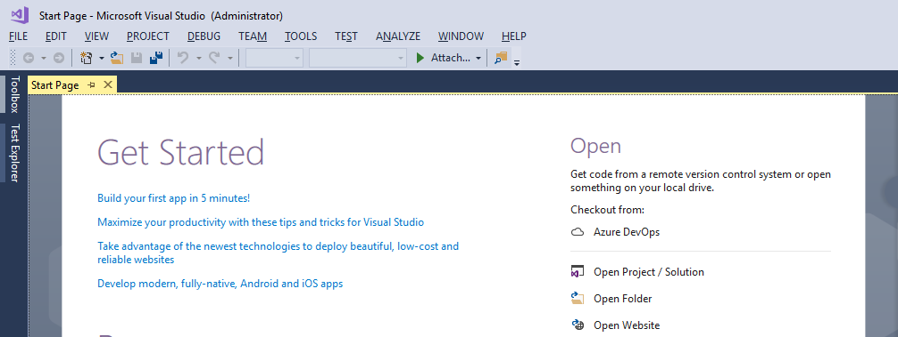

在Microsoft Teams推出后，有大量对此感兴趣的童鞋跃跃欲试，都想尝试一下，将自己的系统或者开发自己的一款应用放在Teams看看效果。

之前有朋友问到过，怎么在本地搭建开发环境，来写自己的应用，进而放在Teams里。

这篇文章就跟大家简单介绍一下如何搭建开发环境。

首先，所需硬件环境就不说了，一台能跑起来（内存最好多余4G）的电脑就好，没啥特殊要求。

再看看软件环境（这里我们默认使用Windows 10系统，如果用Linux或者Mac的童鞋，Visual Studio可以换做目前火爆的Visual Studio Code）

* [Visual Studio](https://visualstudio.microsoft.com/)或者[Visual Studio Code](https://code.visualstudio.com/)  
  写代码环境，不多说。
  
* [Teams客户端](https://teams.microsoft.com/downloads)或者[在线版Teams](https://teams.microsoft.com)  
  写好的应用，需要安装在Teams里来运行测试。  
  这里即可以选择客户端安装，也可以选择网页版。
  
* [ngrok](https://ngrok.com/)  
  内网穿透神器，其他博客里也提到了。很有用，不多说，可以搜搜看。
  安装完成，直接打开，有command line解释，自行查看。
  

好了，以上就是准备好开发所需的软件环境了。

接下来呢，如果写好应用呢，在本地跑起来，如：
  
假如应用跑起来的端口是3333，那么就在ngrok里运行如下命令：
```
ngrok 3333 -host-header="localhost:3333"
```
这里注意-host-header，这个东西加上，以免后边调试遇到网络不通，可能就是因为这个参数噢。

这里我们应用运行起来的端口是3333，所以跑起来的效果如下：  
  

这里圈出来的地址，就是我们在Menifest文件里所要用到的外网地址。即网络数据流向：  
```
Internet -> ngrok server -> localhost:3333
Internet <- ngrok server <- localhost:3333
```
现在我们在App Studio里进行设置，如下：
  

这样就大功告成了，本地任何代码更改，只要重新build，重新跑起来（端口一般不会变），Teams就可以连到我们的开发机器了，后续请求就会转发到本机。

以上就是简单介绍如何搭建Teams应用的开发环境，即如何做内网穿透。

对于内穿穿透工具没有做太多介绍，大家可以自己找找文档。

另外，需要注意的是，Teams里的地址都要是https的，所以ngrok跑起来有两个外网地址，一个http，一个https，我们用的就是https那个。不要搞错了噢，不然会出网络问题，到时候都摸不着头脑。

今天就跟大家介绍到这里啦，下次有机会再跟大家分享更多的好东西噢。