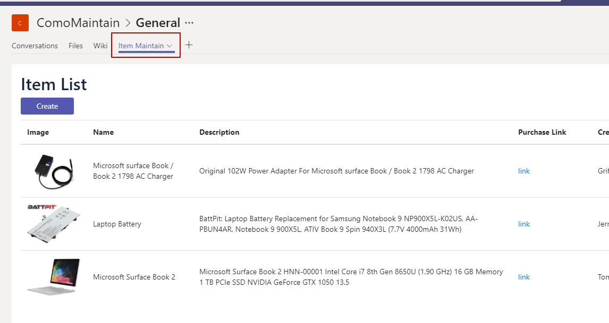

Teams里提供了内嵌第三方系统（网页）的功能，这个功能可以说很强大了，将业务系统整合在一个平台里，这样用户就不用来回切换了。

比如：


之前有童鞋问，什么样的页面才能嵌到Teams的Tab里呢？我脑子不假思索，所有网页都能嵌进来。

后来直到自己在做的时候，发现还是有些限制的，今天就这个问题，跟大家简单做个分享。

### Tab页面有哪些要求？
* 页面允许被iframe。  
有些懂开发的童鞋一眼就瞧出来了。首先，Tab页本质上是通过iframe添加到Teams里的，所以必须不能有同源策略的研制。  
其实所有页面默认都是允许被iframe的，有些为了安全考虑，就加了同源策略限制。
如果将要被嵌入的网页是不被允许iframe的，那么可以针对特殊场景
 * 添加如下header：
```
Content-Security-Policy: frame-ancestors teams.microsoft.com *.teams.microsoft.com *.skype.com
```
 * 设置名为X-Frame-Options的header，值为: ALLOW-FROM https://teams.microsoft.com/


* 必须host在https站点下。
这个不用多说，包括Bot/Connector/Message Extension等其他应用，也都必须是基于https的。http是不被支持的。

* 页面里加载Teams Javascript SDK的方式有好几种，CDN/NPM/Local Resource等等。
* 页面加载后，显式调用
  ```javascript
  microsoftTeams.initialize();
  ```
* 嵌入的页面所使用的域，一定要在manifest文件的validDomains属性中设置了。
  

  以上，有疑问，大家共同探讨。