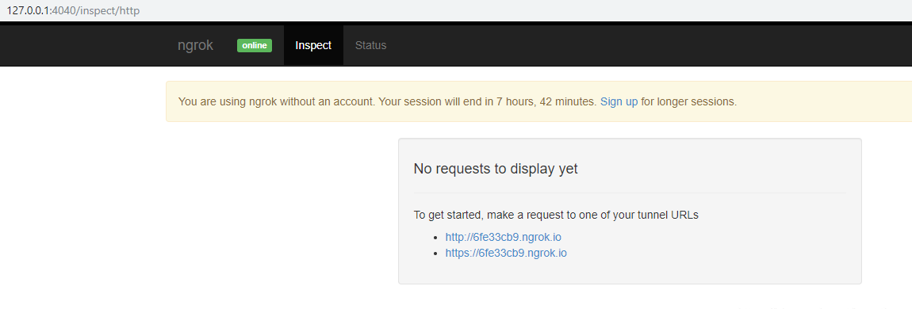
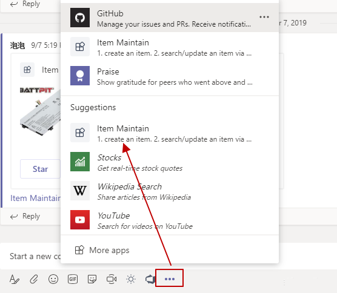
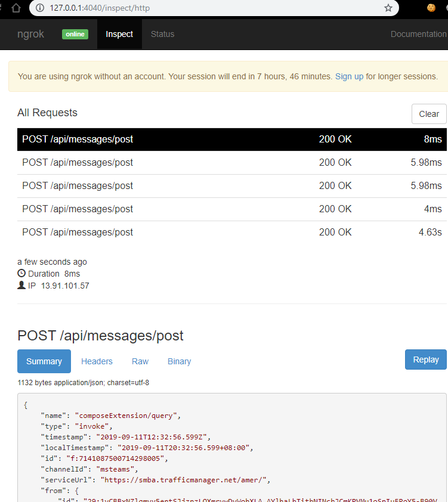
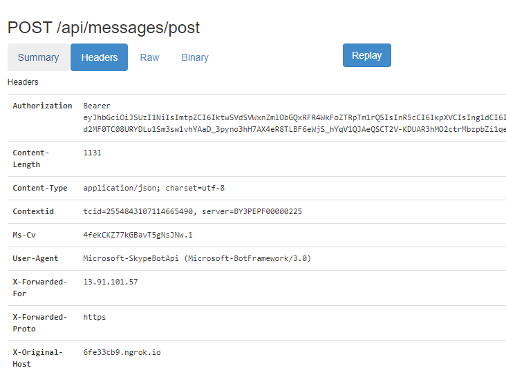
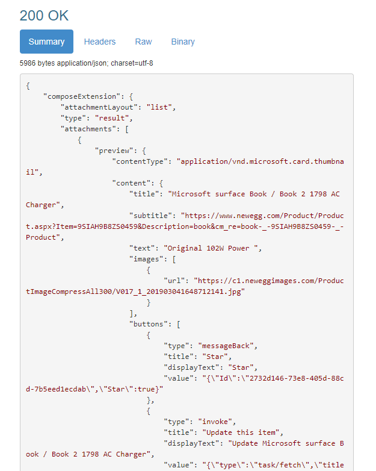

如果大家看了另一篇文章[https://paul-cheung.github.io/how-to-setup-teams-app-develop-environment/](https://paul-cheung.github.io/how-to-setup-teams-app-develop-environment/)，那就会对ngrok有印象。

在Teams下进行开发的同学估计不在少数，也不知道大家平时都是怎么调试代码，跟踪和teams平台的消息的。可能有些人会有疑问，或者平时碰到过类似的问题，不知道怎么解决，或者没找到好的方法。

今天这篇博文就跟大家介绍一下如何使用“穿网神器”来跟踪Teams开发当中的消息体。

大家可以去[这里](https://ngrok.com/)下载，具体如何使用呢，本篇文章就不再累述了，可以参考[这里](https://blog.csdn.net/zhangguo5/article/details/77848658)。

ngrok本身是用于暴露内网地址到外网的，但是本身也带了很强大的inspect功能，可以看到每个请求的详细信息。

闲言少许，直接上教程。首先本地run起来ngrok，跑起来以后会有一个地址是Web Interface：

  
假如应用跑起来的端口是3333，那么就在ngrok里运行如下命令：

```
http://127.0.0.1:4040/inspect/http
```
直接在浏览器中输入这个地址，就能看到如下界面：
  

接下来，我们在Teams里的Message Extension中请求数据。  

* 找到应用，这里叫Item Maintain
  

* 输入关键字搜索【这里会请求到后台服务获取数据，其他应用可能功能不一样，但思路是一样的，这里用搜索这个场景解释这个过程】
  

* 当结果搜索出来以后。这时候我们再回到刚才的Web Interface地址：http://127.0.0.1:4040，刷新页面。
这时候会发现，已经可以看到刚才搜索的请求及响应了，如下：
  

再看看请求和相应数据。
* 请求【请求体/请求头等】
  

* 响应【响应体/响应头等】
  

实际上这个作用就很大，碰到应用调试中不好解决的问题时，可以看看请求体和响应体，看看是否有问题，比较方便。

当然，如果用网页版Teams的话，F12开发者模式也可以抓到请求，只不过没那么方便，界面看起来也不友好，看得累。

以上就是通过工具来跟踪应用和Teams之间的消息，便于提高开发效率。今天的分享就到这儿，后续有什么好东西，我会继续分享的~~~~

感谢阅读！！！