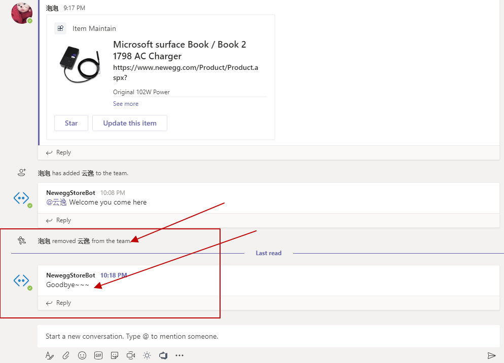

微软Teams里的Bot想必大家不陌生，可以在Teams跟Bot进行图文聊天。  

当然，Bot的聊天逻辑还得看具体实现，那么除了输入框里的内容还有图片，有没有其他类型的交互呢？答案是有。

是什么呢？这就是我们今天要聊的Bot Event。

对于Bot事件，官方也给出了event的列表，这里跟大家做个解释：

| <div style="width:150px">类型</div>|<div style="width:150px">数据</div>|<div style="width:150px">事件类型</div>|<div style="width:200px">描述</div>|<div style="width:150px">作用范围</div>|
|:----|:----|:-------|:----|:----|
|conversationUpdate|membersAdded|teamMemberAdded|添加到Team里的成员|所有|
|conversationUpdate|membersRemoved|teamMemberRemoved|成员从团队中被移除|群聊&团队|
|conversationUpdate||teamRenamed|重命名团队|团队|
|conversationUpdate||channelCreated|频道被创建|团队|
|conversationUpdate||channelRenamed|频道被重命名|团队|
|conversationUpdate||channelDeleted|频道被删除|团队|
|messageReaction|reactionsAdded||和Bot消息的交互，比如点赞等|所有|
|messageReaction|reactionsRemoved||和Bot消息的交互，比如取消赞等|所有|

被支持的事件类型有上面这些，那么我们可以用在哪些尝尽里边呢？比如：
* 某个用户对Bot的某条消息点赞
* 当Bot被添加到团队里的时候，可以发一条消息到频道里。

* 可以获取群组信息并缓存。
* 更新缓存群组的缓存数据。
* 当Bot被移除的时候，可以发条消息到频道里，或者清除缓存的群组信息

* 还有其他场景，各位童鞋可以自己脑补，或者想想自己的业务场景。

Bot事件在数据交互的时候也是作为一个Activity来体现的，里边包含了消息类型，表明Activity是那种类型。

还是通过上篇文章里的工具查看消息，如果我们从团队中移除掉某个人员，那么Bot可以收到一条消息，具体内容如下
```
{
    "membersRemoved": [ // 这是个数组，表明被删除的用户
        {
            "id": "29:1p0UNKp9EQ2dq1ZObdn_Ipy7Dnhq6mpr8BDA79ln-ljGOYUX-57fz9V2xC4dtSevIQ25Dwqo_PlNl74x7RgJTzQ",
            "aadObjectId": "55d61939-bf05-4ddb-a5f9-edb8cf98eb56" // 用户在Azure AD里的Id
        }
    ],
    "type": "conversationUpdate", // 这个就是类型
    "timestamp": "2019-09-11T14:18:39.746Z",
    "id": "f:54296b6d-5eb3-29a5-3dfb-a7c965ca8505",
    "channelId": "msteams", // 频道Id，默认的频道Id就是msteams
    "serviceUrl": "https://smba.trafficmanager.net/amer/",
    "from": {
        "id": "29:1vCBBxNZlqmvy5entSJjznzLQXmrvwDvWohXLA_AYlhaLhTithNINcbJCmKPVMu1oSnIuEPoY5-B90VOYO7_AJQ",
        "aadObjectId": "eb0e805f-e338-4e36-ac52-3dc4ee5af7d0"
    },
    "conversation": { // 会话的一些属性，是不是群聊等
        "isGroup": true,
        "conversationType": "channel",
        "tenantId": "58d1119d-f845-443e-a697-922d23fef47f",
        "id": "19:56ba74589ac040f38723fe7cc75bb3a9@thread.skype"
    },
    "recipient": { // 消息接受者
        "id": "28:f6a7af57-a5c6-4e18-a3e5-1ab6793ce6d1",
        "name": "NeweggStoreBot"
    },
    "channelData": { // 这里边是一些有用数据，团队的信息（名称/id等)
        "team": {
            "id": "19:56ba74589ac040f38723fe7cc75bb3a9@thread.skype",
            "name": "MaintainCoupon",
            "aadGroupId": "26ff5827-92e9-407e-bdef-e5cd6a2deee9"
        },
        "eventType": "teamMemberRemoved", // ~~~~~这个就是事件类型
        "tenant": {
            "id": "58d1119d-f845-443e-a697-922d23fef47f"
        }
    }
}
```

上述的数据内容，比如channelData.eventType就是一开始表格里的那些；还有就是type属性，可以跟上边的表格对比起来，可以找出更多场景。

这里只是简单介绍一下Bot事件的类型和我们可能用到的场景，没有做太多场景细化。

怎么使用能让我们的业务更丰富更饱满，就看各位大神们怎么使用了。

冲🦆🦆🦆🦆🦆🦆！！！！！！！！

