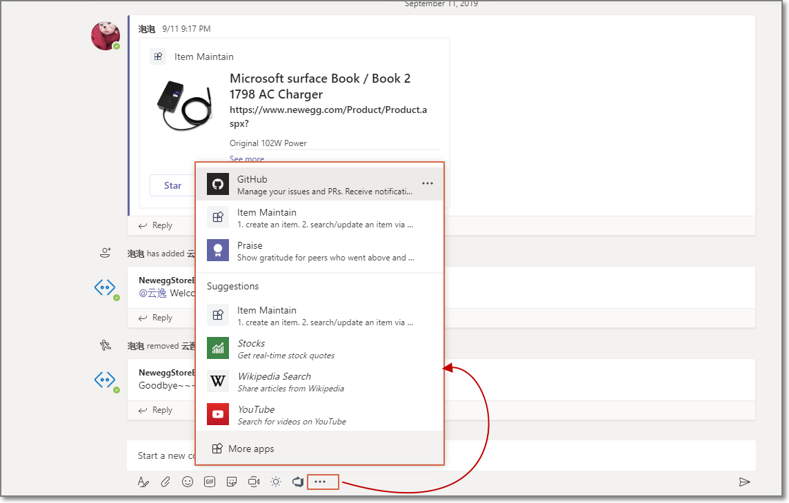

了解Microsoft Teams产品的童鞋都知道，微软提供了Tabs、Bots等很多强大的第三方集成功能。Message Extension可以很方便的定制化自己的业务系统，丰富已有的业务流程。

Message Extension又为用户提供了高度可扩展、深度定制开发的选项和能力。

今天就跟大家简单介绍一下非常强大的Message Extension功能，实际上这个东西已经出来蛮久了，可以极大地丰富现有功能，也为业务系统提供了更多的方案选择。

### 什么是Message Extension?

说白了，Message Extension提供了一种很强大的途径，以便我们和Teams集成。  
有了这个功能，Teams用户可以查询或者提交信息/数据给我们自己的服务。  

### 位置
Messaging extensions的位置紧挨输入框的下边。默认包含了很多内容，包括表情、动图、标签等等。

想查看更多，或者安装其他的Message Extension，我们选择More Options (⋯)按钮即可，这里既可以online查找安装，也可以看到我们自己上传的应用。  

一图胜千言，图能说明一切问题

### 作用/场景

当然，所有的技术出来都是为了解决业务问题的，那么Message Extension可以解决哪些问题，或者说可以用在哪些场景呢？

* 如果是软体公司，可以提bug。当然也可以创建任务。
* 非软体公司，可以创建任务。
* 做售后/服务的可以创建支持票据。
* 报表
* 图片和多媒体内容
* 销售机会
* 等等【自己头脑风暴】

### 类型

目前有两种类型的Message Extension，没有哪个好那个不好，各有千秋。

每种类型都有自己特殊的定位和功能，根据我们自己的业务场景选择合适的即可。

#### 基于搜索的Message Extension
这种Message Extension可以从我们自己的服务上查询信息，并将查询到的信息插入到输入框里，当作消息一起发送【实际可以有很多丰富的体现】。

实际场景也比较多。

比如，有个指给我的bug，我感觉搞不定，想发给我的同事帮忙处理。这样，我就通过Message Extension搜索到这个bug，然后将其当作消息的一部分发送给我的另一个同事。

#### 基于Action的Message Extension

这种Message Extension可以收集用户输入的数据，然后提交给我们自己的服务，也可以给第三方服务，这种场景平时也比较常见。

比如，今天出去吃了个饭，认识一个朋友，我觉得可能成为一个很好的销售机会。

这时候，我们就可以有一个类似“销售机会跟踪”的Message Extension，该应用提供信息收集功能。我输入客户的名称和联系方式，还可以包含其他一些有用的信息，然后创建一个销售机会。

当然，创建以后，也可以通过搜索（第一种的Message Extension）将这条记录发给同事。

### 写在最后
Message Extension本身只是提供一种技术手段，我们可以通过这种方式来实现我们自己的业务场景。

可能后续也会有其他更强大的类型的Message Extension出来，可以实现更吊炸天的功能，这个我们可以期待，一起关注Teams的最新进展。

同时，微软也很希望听到用户和各位开发者的声音。如果大家有什么好的建议或者意见，就可以在官方的[User Voice](https://microsoftteams.uservoice.com/forums/555103-public)里提建议，一起参与到Teams的发展进程中来。

最后，希望大家能利用Message Extension开发出自己的业务系统，解决自己实际碰到的问题。

