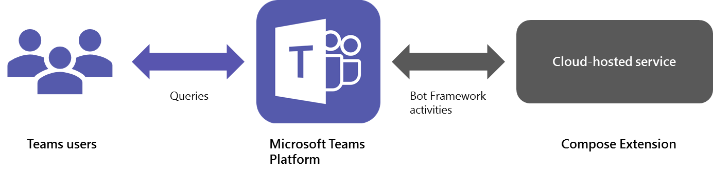
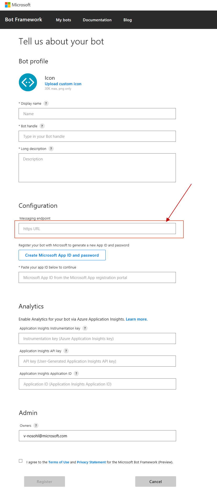
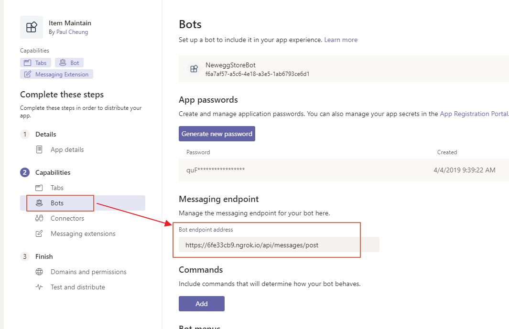

本来想跟大家分享一个Message Extension的示例呢，比如上次说的基于搜索的Message Extension。

但是鉴于可能有一部分人还不太了解怎么集成Teams和我们自己开发的应用，今天就先跟大家介绍一下具体的集成方式和manifest.json文件。

### 集成方式
我们写好服务后，会host在外网上，比如Azure, Amazon或者自己的服务器，然后暴露服务接口在外网。

然后告诉Teams我们自己的服务地址在哪儿，好让Teams跟我们的服务进行交互。

如下流程：



实际上右边的Microsoft Teams Platform和Compose Extension交互的过程是我们需要额外关心的，Cloud-hosted service就是我们部署在云端或者外网的服务。

那么，Teams怎么知道我们服务的地址，进而发消息给我们的服务呢？

这个问题的答案，就是我们几天要介绍的manifest.json文件。

其实，有很多第三方开发都是这种模式，也就是说，我们将相关信息写在manifest.json文件中，再将manifest.json文件上传到Teams里。

这样Teams在安装运行的时候，会找到我们服务的地址，进而进行数据交互。

这里我们就先介绍一下Teams怎么跟我们的服务通信的。

### Teams如何与我们自己的服务进行通讯？

* 首先，我们通过[Portal](https://dev.botframework.com/bots/new)注册我们的Bot，最后会得到一个BotId。  
  当然，注册过程中会有需要输入接受消息的endpoint选项，如图：
  
  如果开发阶段使用App Studio来设置Message的endpoint，就更方便了。如下：
  
* 第一步我们告诉Bot的endpoint了，这时候Bot和Endpoint就关联起来了。  
  这一步呢，我们再在manifest里填写BotId，这样Teams应用就知道和哪个Bot进行
  消息交互，进而找到我们设置的endpoint。
  如下（讲到Bot也就一起看看Bots节点下的相关属性）：
  ```json
      "bots": [
        {
            // 这里就是我们的BotId
            "botId": "<<BOT-ID>>",
            // Bot的使用范围，个人聊天/团队
            "scopes": [
                "personal",
                "team"
            ],
            // Bot包含的command列表，每个command也可以设置单独的scope
            "commandLists": [
                {
                    "scopes": [
                        "personal"
                    ],
                    "commands": [
                        {
                            "title": "Search for an item",
                            "description": "Search for an item"
                        }
                    ]
                },
                {
                    "scopes": [
                        "team"
                    ],
                    "commands": [
                        {
                            "title": "Search for an item",
                            "description": "Search for an item"
                        }
                    ]
                }
            ],
            // 是否支持文件
            "supportsFiles": false,
            // 表明Bot是不是只用作推送的目的。
            "isNotificationOnly": false
        }
    ],
  ```

上面介绍了Teams如何与我们自己的服务进行交互，也就是Bot节点的详细信息，接下来我们看看Message Extension的内容。

### manifest中的Message Extension节点
```json
// Message Extension的节点名称，为了向前兼容，名字就叫这个
"composeExtensions": [
        {
            // 依然是BotId
            "botId": "<<BOT-ID>>",
            // 能不能右键唤出设置页面
            "canUpdateConfiguration": true,
            // 命令列表
            "commands": [
                {
                    // command的id，实际上是个列表内唯一的字符串
                    "id": "SearchItem",
                    // 命令的类型，query或者action
                    "type": "query",
                    // 相当于placeholder
                    "title": "search an item",
                    // 结果中无内容的时候显示的内容
                    "description": "Search result will be here.",
                    // 表明是不是一开始就运行一次
                    "initialRun": false,
                    // 命令的参数列表
                    "parameters": [
                        {
                            "name": "keyword",
                            "title": "keyword for searching an item",
                            "description": "keyword for searching an item",
                            "inputType": "text"
                        }
                    ]
                }
            ]
        }
    ],
```

当然，composeMessage节点下还有其他很多属性，这里只是对常用的进行解释，其他的内容大家可以自己查询。

其实，还有tab等节点，鉴于篇幅有限，这里我们只看看其他基本信息。

### manifest中的其他基本信息都有哪些？
包括app的信息，描述，作者等等。如下：
```json
{
    // manifest的schema地址
    "$schema": "https://developer.microsoft.com/en-us/json-schemas/teams/v1.5/MicrosoftTeams.schema.json",
    // manifest使用的schema版本
    "manifestVersion": "1.5",
    // 应用包的版本
    "version": "1.0.0",
    // 应用的Id，一般和BotId保持一直
    "id": "<<Id>>",
    // 此应用包的名称
    "packageName": "item.maintain.newegg.teams.com",
    // 开发者信息
    "developer": {
        "name": "Paul Cheung",
        "websiteUrl": "<<website url>>",
        "privacyUrl": "<<privacy url>>",
        "termsOfUseUrl": "<<terms of use url>>"
    },
    // icon相关，图片大小尺寸都有相关文档查询。
    "icons": {
        "color": "color.png",
        "outline": "outline.png"
    },
    // Application的名称，一长一短
    "name": {
        "short": "Item Maintain",
        "full": "maintain store item with team member, and provide searching functionality for others."
    },
    // 描述信息，简单/全描述
    "description": {
        "short": "1. create an item. 2. search/update an item via searching.",
        "full": "1. create an item for being searched via Task Module feature in Tab.\n2. search an item via message extension.\n3. update an existing item via Task Module feature in Bot Card button.\n4. message notification for adding member, removing member, rename team or channel, like/unlike a message from a bot, and etc."
    },
    // 权限相关
    "permissions": [
        "identity",
        "messageTeamMembers"
    ],
    "validDomains": [
        // 允许Teams访问的可信任域
        "6fe33cb9.ngrok.io"
    ]
}
```

这里包含了一些基本信息，其他不在列的信息，大家可以自行查询。

好了，今天就跟大家分享到这里，后续有什么更新，再跟大家一起分享噢。