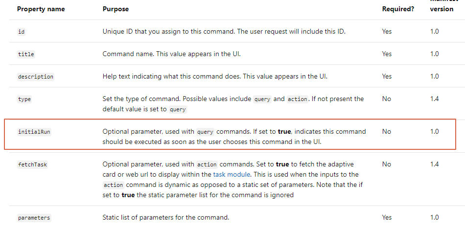

前两天的一篇[文章](https://paul-cheung.github.io/what-is-message-extension/)对Teams开发里的Message Extension做了简单的介绍，没看的同学可以先瞄一眼。

今天主要跟大家讲一下上篇文章中提到的两种类型中的第一种，也就是基于搜索的Message Extension。

基于搜索的Message Extension也跟大家介绍了，场景不在列举。

这里就直接上示例，我本人是从事电商行业的。大家都知道，凡是电商，就会遇到一个问题，就是庞大的SKU需要维护，所以本片文章会基于这个场景来介绍一个基于搜索的Message Extension。

### 基于搜索的长什么样？

一图胜千文


我新建了一个名为“Item Maintain”的Message Extension来跟大家介绍这个类型。

跟其他应用一样，没啥特别的，直接点击进入应用，如下所示：  


在没输入关键字的时候，没有搜索结果。


输入关键字进行搜索，结果会展示出来。

当然，也提供了初始化运行的参数，大家根据需要设置即可：


这里不对上述参数做过多解释，主要看下后台代码。

### 后台代码展示

#### 首先看Endpoint
```csharp
[HttpPost]
public async Task<HttpResponseMessage> Post([FromBody] Activity activity)
{
    using (var connector = new ConnectorClient(new Uri(activity.ServiceUrl)))
    {
        // Activity提供现成的基于搜索的判断，方法顾名思义。
        if (activity.IsComposeExtensionQuery())
        {
            // 这是我自己写的额外的方法，后续再展开说明。
            var response = MessageExtension.HandleMessageExtensionQuery(connector, activity);
            if (response == null)
            {
                return new HttpResponseMessage(HttpStatusCode.OK);
            }
            // 这里做了个简单判断，返回ComposeExtensionResponse的response，大家可以按照自己的场景来。
            if (response.GetType() == typeof(ComposeExtensionResponse))
            {
                return Request.CreateResponse<ComposeExtensionResponse>((ComposeExtensionResponse)response);
            }

            // 默认返回200
            return new HttpResponseMessage(HttpStatusCode.OK);
        }
        else
        {
            // Other business logic processing.   
        }
    }
}
```

以上就是服务的入口，下边主要看看`MessageExtension.HandleMessageExtensionQuery`方法，主要逻辑都在这里。
```csharp
public static object HandleMessageExtensionQuery(ConnectorClient connector, Activity activity)
{
    switch (activity.Name)
    {
        // 基于搜索的Activity的名字为composeExtension/query
        case "composeExtension/query":
            {
                // 框架方法获取query对象
                var query = activity.GetComposeExtensionQueryData();
                // 这里对输入的command做个简单的验证，
                // 即s_availableCommandIdList里包含了允许的所有command(menifest文件里))。
                if (query != null && s_availableCommandIdList.Contains(query.CommandId))
                {
                    return QueryData(connector, activity, query);
                }
                break;
            }
        default:
            break;
    }
    

    return null;
}

// 搜索的逻辑在这里。
private static ComposeExtensionResponse QueryData(ConnectorClient connector, Activity activity, ComposeExtensionQuery query)
{
    var keyword = "";
    // query对象里的参数，也都是menifest文件里定义好的。
    var titleParam = query.Parameters?.FirstOrDefault(p => p.Name == "keyword");
    if (titleParam != null)
    {
        keyword = titleParam.Value.ToString();
    }

    if (string.IsNullOrEmpty(keyword))
    {
        return null;
    }

    // ItemDB.SearchItems是自己的搜索业务逻辑，或者call数据库或者call服务，看自己需要。
    var filteredItems = ItemDB.SearchItems(keyword);
    if (filteredItems == null || filteredItems.Count <= 0)
    {
        // 实际上返回个空列表，界面就没结果显示。
        return new ComposeExtensionResponse(new ComposeExtensionResult("list", "result"));
    }

    var attachments = new List<ComposeExtensionAttachment>();
    foreach (var item in filteredItems)
    {
        // 将搜索到的item转为ComposeExtensionAttachment
        attachments.Add(GetItemAttachment(item));
    }

    // 以list返回结果
    var response = new ComposeExtensionResponse(new ComposeExtensionResult("list", "result"));
    response.ComposeExtension.Attachments = attachments.ToList();

    return response;
}

private static ComposeExtensionAttachment GetItemAttachment(ItemInfo item)
{
    var card = new ThumbnailCard
    {
        Title = item.Name,
        Text = item.Description.Length > 20 ? item.Description.Substring(0, 20) : item.Description,
        Images = new List<CardImage> { new CardImage(item.Image) },
        Subtitle = item.Link,
        Tap = new CardAction() { Type = "postBack", Title = item.Name, Value = "http://{{link}}", Image = item.Image },
    };

    return card
        .ToAttachment()
        .ToComposeExtensionAttachment();
}
```

搜索出的结果以列表形式展示在搜索框下方，点击后的操作及时上述代码第145行所定义的CartAction.Type，这里是将value直接放在输入框。

大家可以根据自己的需要，自行修改。

### 总结

基于搜索的Message Extension很棒很强大，利用好它简直会起飞，分分钟提高业务效率。

更多信息，请参考[官方文档](https://docs.microsoft.com/en-us/microsoftteams/platform/concepts/messaging-extensions/search-extensions)

今天就跟大家分享到这里，下次有机会我们再一起探讨其他比较炸的功能。