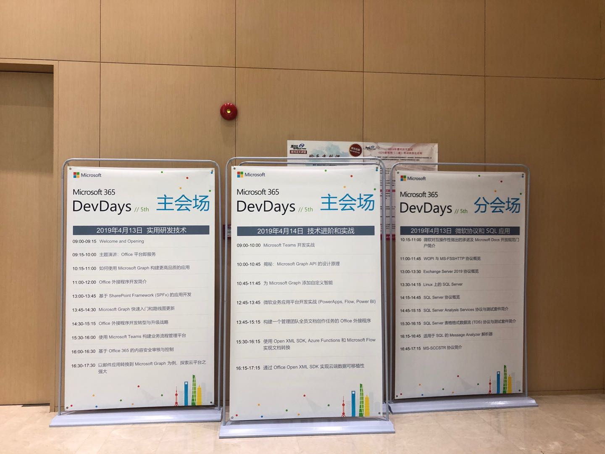
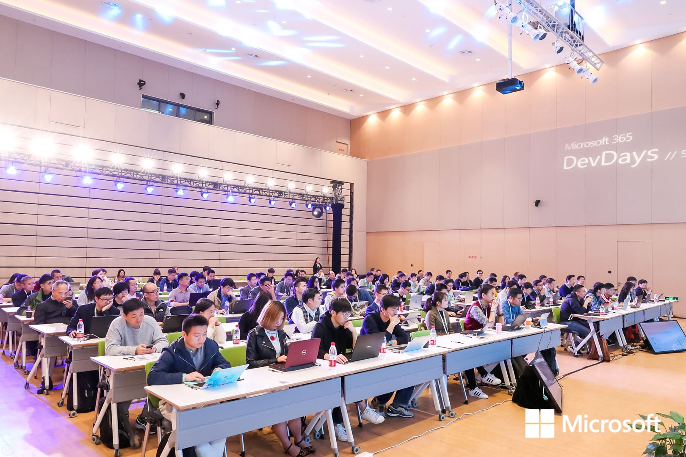
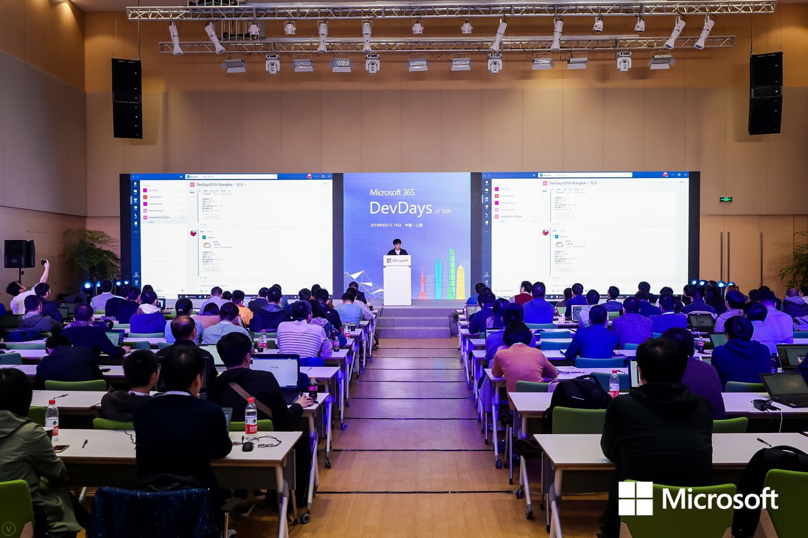
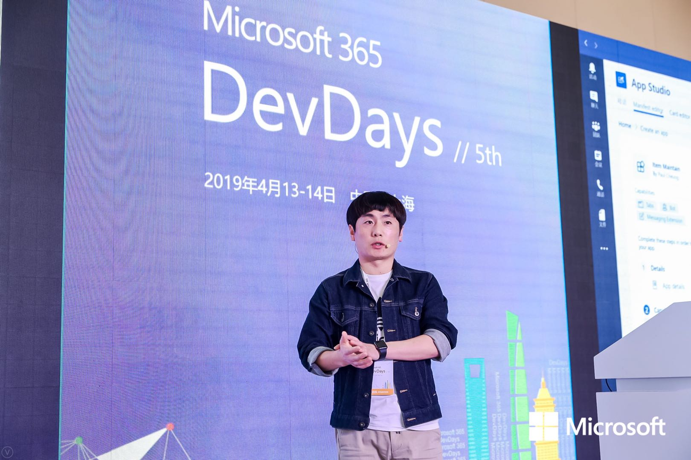

在4 月 13 日-14 日，第 5 届 Microsoft 365 DevDay在上海漕河泾开发区会议中心盛大举行！这次活动，很多微软总部研发大牛莅临现场，现场干货满满；

内容很丰富，涵盖了Microsoft 365， Office 365，Windows 10，云计算及数据平台等相关技术。

通过这次大会，也认识了很多技术大牛，学习了很多东西。

现场的也很火爆

### 有幸参与技术分享，主要介绍了Task Module和Bot Event，还有Message Extension相关的内容

除了讲的内容，也通过提问环节了解到了大家对Teams的认识和遇到的问题，也跟大家一一沟通并解答。

希望在后续的Event中能跟大家分享更多相关的内容。