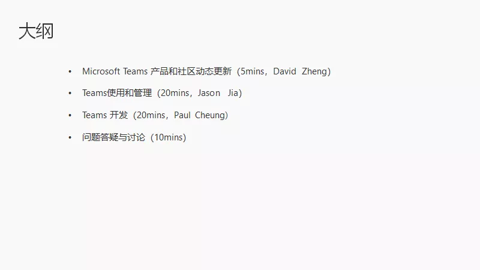
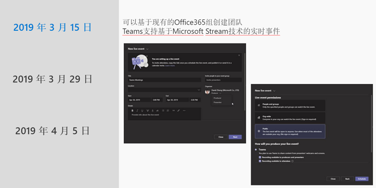
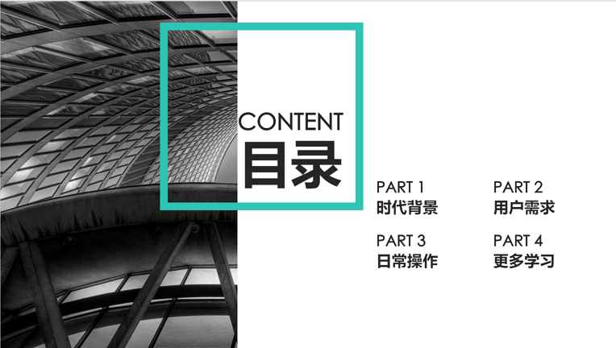
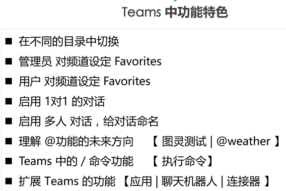
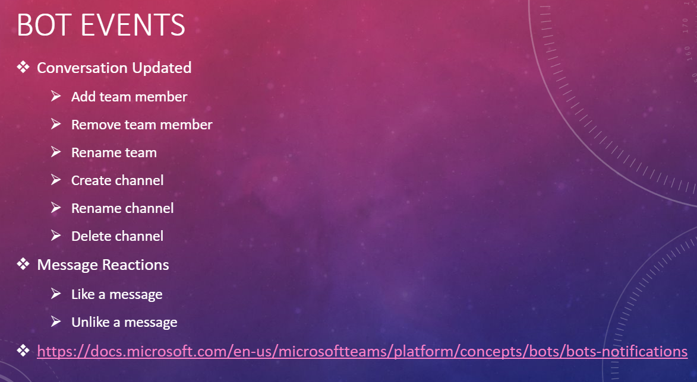
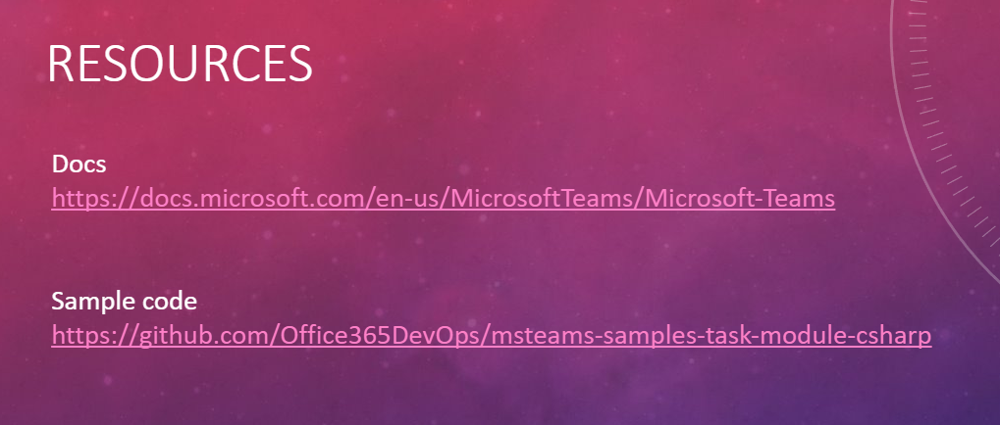

这次会议，其实也是Microsoft Teams技术社区的第九次月度会议。

因为第二天就劳动节放假了，这次会议虽然在工作日，但也轻松。但是，前期组织还是有点小插曲，和往常不一样。

其实月初我就跟版主在社区里找分享者和演讲者了，大家一开始都蛮积极的参与，有好几个报名演讲的社区童鞋。

但是日程出来，也是好几个人一看，发现是小长假前一天，可能有很多人请假出去玩，所以中间有两个人退出了。

没办法，只能再找，其实计划是三个人。后来，我自告奋勇，讲了一部分开发相关的东西。

陈老师其实也是临时有事，在台湾那边参加会议，所以不能参加这次会议，所以版主来开了个场，算是小插曲了。

会议一开始其实和往常一样。

先来个大纲

David做了Teams相关更新的一些分享和社区动态。

包括私人团队，和团队人员数量上线的更新，支持白板。

Jason老师做了Power平台的分享，可谓是干活满满，从海量PPT内容就可见一斑，来个管中窥豹。

从时代背景开始，讲到微软的生产力，包含跨设备体验，音视频，即时消息，数据分析，以及使用以上内容形成的一整套生态系统。

其实，这部分内容对还没有完全上微软生态系统的企业还是很有帮助的，有个整体的概览。

用户在工作生活中真正遇到的问题呢，也是微软生态在解决的。

会议当中也有一些与会者是刚入门Teams和Power相关的小白，问到了消息扩展的实现原理，大家也一起讨论给出了解答。

最后是我讲的内容，Bot Event和Task Module，还有Demo，虽然是经历了好几次月会并且是线上，但是第一次讲还是有点紧张，生怕出错。

线上的几个开发者询问有没有sample code，其实官方是有的，但是我在此基础上改了一些东西，放在Github上，供大家参考。

其实Task Module当时也是出来不久，对很多用户和开发者来说是新的东西，新的体验，其中的开发流程和原理，也都讲了一下。

有个来自深圳的童鞋问到，teams有没有好的工具可以实现下面场景：有一个虚拟账号叫值日生，后台可以管理这个值日生的具体值班人。使用场景比如noc值班，各种答疑接口，这样对外只展现一个人，大家找这个虚拟值日生就可以了，也不用问今天谁值班了。

这个场景，大家都很有兴趣，花了十来分钟来讨论，好像也不想shift schedule，最后想到，貌似Bot是最适合的了。

其实，每次大家分享的内容都有新东西，也都有值得学习的技术。

在这里，也希望有兴趣的你们都参加进来。