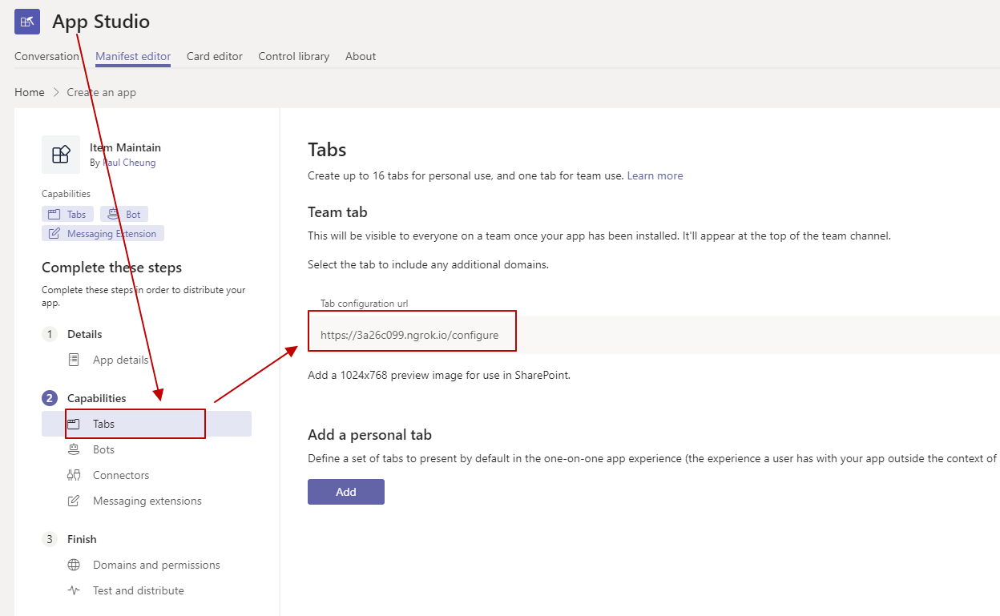
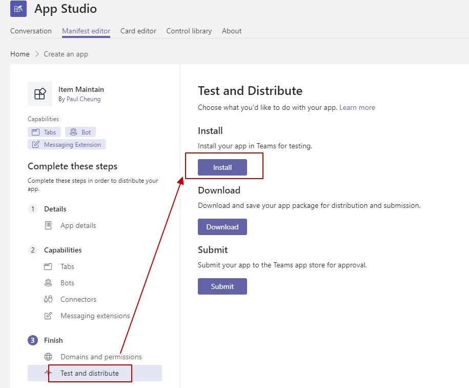
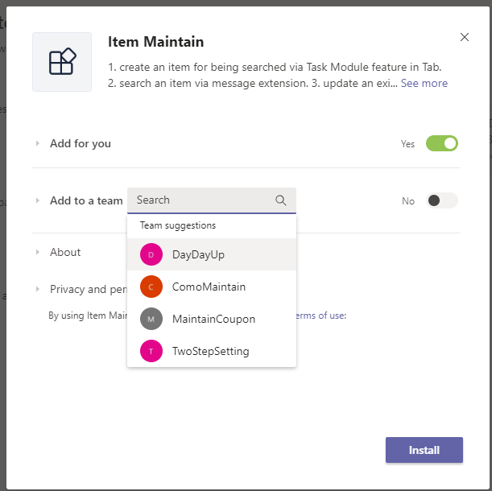
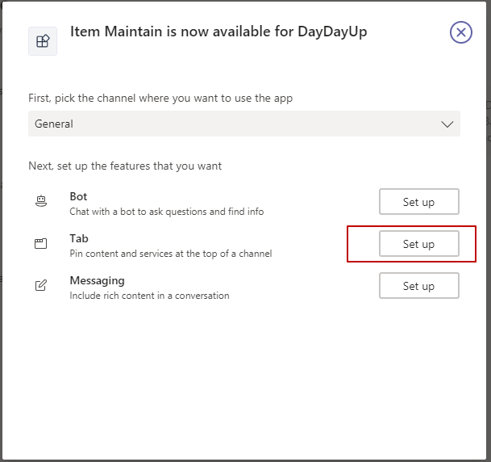
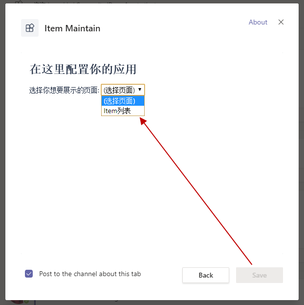
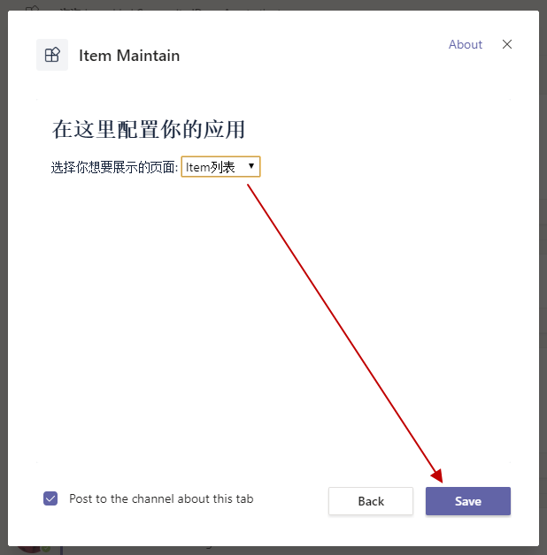
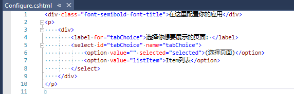
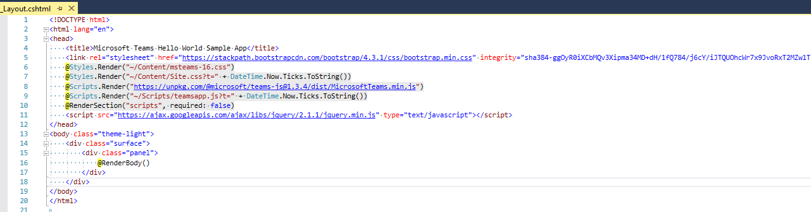

在另一篇文章(https://paul-cheung.github.io/requirements-for-teams-tab/)里，我提到了什么样的页面是可以添加到Teams里作为Tab页存在。

有时候我们希望添加页面的时候，去选择展示的页面，也就是teams提到的配置页面。

这篇文章，我们就介绍一下Tab里的配置页，及相关代码逻辑。

往常的套路，先上一组图片，来看看如何通过App Studio添加Tab。

* 添加Tab的配置页  


* 选择Test and distribute，点击Install


* 选择将Tab安装到哪个team组


* 选择需要安装的功能模块。由于一个menifest文件里可以指定多个模块，比如添加Tab的时候也可以存在Connector，或者Message Extension功能模块，所以这里会有一个选择的步骤，需要安装哪个功能。这里选择Tab，点击Set up。


* 点击Set Up会进入配置页面，这个页面的内容都是我们自己代码里的数据，一会儿跟大家解释一下：


注意，这时候Save按钮还是不可用状态，为什么呢？待会直接看代码。

这里先选择“Item列表”，选择以后Save按钮会变成可用状态，这个也是在代码里进行判断的。


安装完成以后，就是[文章](https://paul-cheung.github.io/requirements-for-teams-tab)里的效果。

现在我们来看看这个配置页相关的代码（这里用asp.net mvc，也就是cshtml文件，其他页面大家自行拓展）


再看看还load了哪些页面资源


上边是页面加载需要的资源，有css，js等。那么页面本身的js逻辑是怎样的呢？也就是上图第9行的teamsapp.js(这里加了个t的query string是为了及时刷新，避免浏览器缓存。如果上生产环境，这样写会被打的，哈哈哈哈哈)
```javascript
(function () {
  'use strict';
  // 初始化teams第一句，必须写~~~~~~
  microsoftTeams.initialize();

  // 保存配置
  microsoftTeams.settings.registerOnSaveHandler(function (saveEvent) {
    // 告诉Teams，需要展示哪个页面
    microsoftTeams.settings.setSettings({
      contentUrl: createTabUrl(),
      entityId: createTabUrl()
    });

    // 通知Teams，我们配置已经选择成功了。
    saveEvent.notifySuccess();
  });

  // 我们选择配置的逻辑
  document.addEventListener('DOMContentLoaded', function () {
    var tabChoice = document.getElementById('tabChoice');
    if (tabChoice) {
      tabChoice.onchange = function () {
        var selectedTab = this[this.selectedIndex].value;

        // 关键是这里，Save按钮启用逻辑。
        // 这里我们判断，如果下拉框选择的是listItem，我们就告诉Teams，Save按钮可以启用了。
        microsoftTeams.settings.setValidityState(selectedTab === 'listItem');
      };
    }
  });

  // 创建Teams需要加载的页面URL，当然这里简单起见，如果需要query string，也可以根据自己需要添加。
  function createTabUrl() {
    var tabChoice = document.getElementById('tabChoice');
    var selectedTab = tabChoice[tabChoice.selectedIndex].value;

    return window.location.protocol + '//' + window.location.host + '/' + selectedTab;
  }
})();
```

上面给出了每个步骤的解释，大家可以自己玩玩看。

其实Teams官方提供的Javascript SDK提供了蛮多API，都可以拿来用噢，今天就先跟大家介绍到这里啦。

后边有机会再跟大家分享其他好玩的。