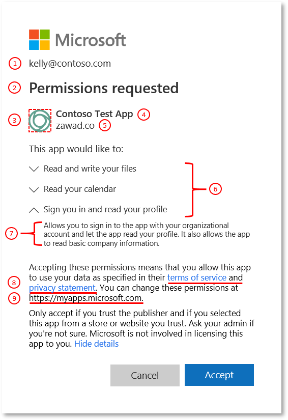
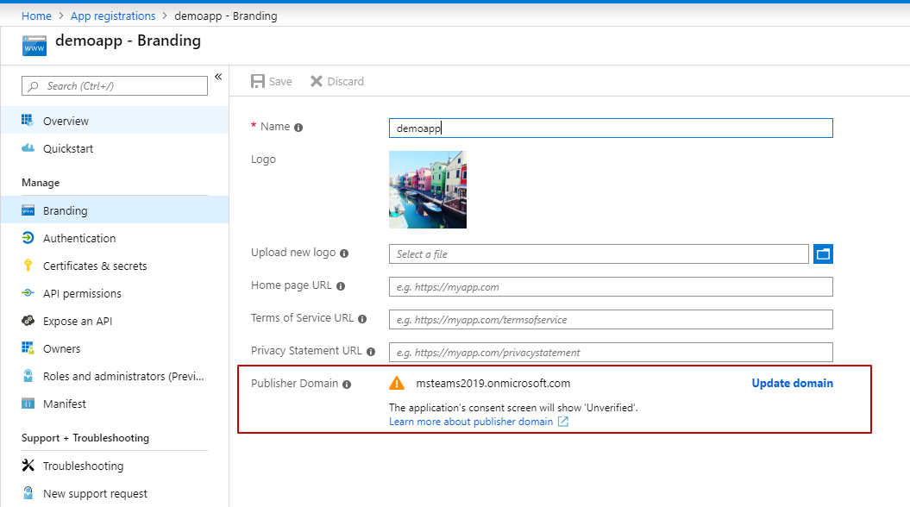
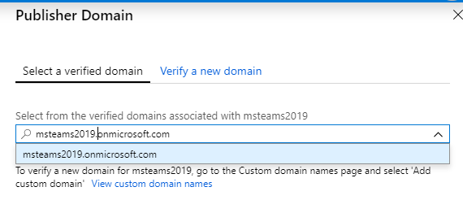
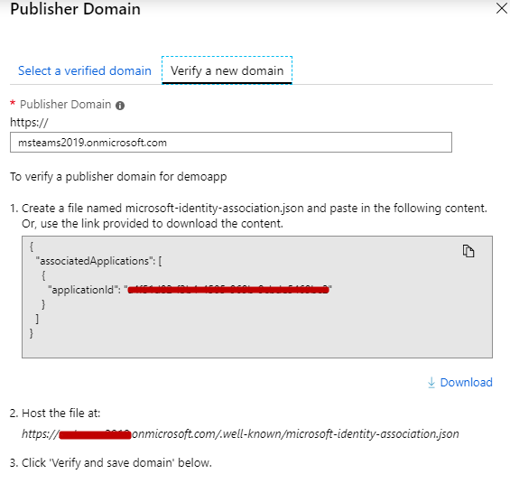

之前的文章 [bot application admin consent](https://paul-cheung.github.io/admin-consent-for-teams-bot-application//)里，我们提到了怎么提升Application的权限。其中有一个问题是在最后一张图中的unverified字样，为什么会显示这个呢？

今天我们就简单聊聊这个问题，其实在Azure系统里这个叫“publisher domain”。在开始之前我们看看，如果unverified这里正常情况下怎么显示呢？来个官方图片（https://docs.microsoft.com/en-us/azure/active-directory/develop/application-consent-experience）。

这个域名的作用是啥呢？其实就是告诉有权限的操作用户，这个权限提升以后，相关数据会发给谁。上篇文章中留了个问题，是从什么时候开始这个地方就显示unverified的呢？查了下是从2019-05-21开始，多租户的应用会显示这个（当然，还要是没有认证的域）。

顺便再提一下多租户的概念，多租户即不仅仅支持一个组织下的账号，其他组织下也能支持，或者Microsoft accounts。

回到我们的主题。当注册Bot的操作是在租户下完成的，那么注册完成后就会有默认的Domain给到我们“*.onmicrosoft.com”，类似于这样的。那如果，在租户下边已经有验证的域名，那系统会自动取已经验证通过的域名来做publisher domain的值。

如果多租户的应用publisher domain没有设置，在管理员页面就会看到unverified字样。当然，如果设置为以.onmicrosoft.com结尾的，也是这样。

那么如何设置让它不显示unverified呢？下面给出步骤。

* 打开Azure Portal里的 [App Registration](https://portal.azure.com/#blade/Microsoft_AAD_RegisteredApps/ApplicationMenuBlade)页面

* 点击Update domain按钮，这时候分两种情况
  * 如果应用是在租户下创建的，会看到两个Tab：Select a verified domain和Verify a new domain。
  * 如果应用不是在租户下创建的，那么只能看到一个Tab：Verify a new domain。
* 如果有Select a verified domain选项，则可以下拉选择一个verified的域。

* 如果只有Verify a new domain，则根据提示创建 __microsoft-identity-association.json__ 文件，然后host在对应站点上。

* 点击Verify and save domain按钮，完成以上操作。

注：以上就是设置publisher domain的步骤。目前这个设置的操作，还没有提供RESTful接口支持，也没有提供Powershell的支持。官方什么时候能给出支持，让我们拭目以待。