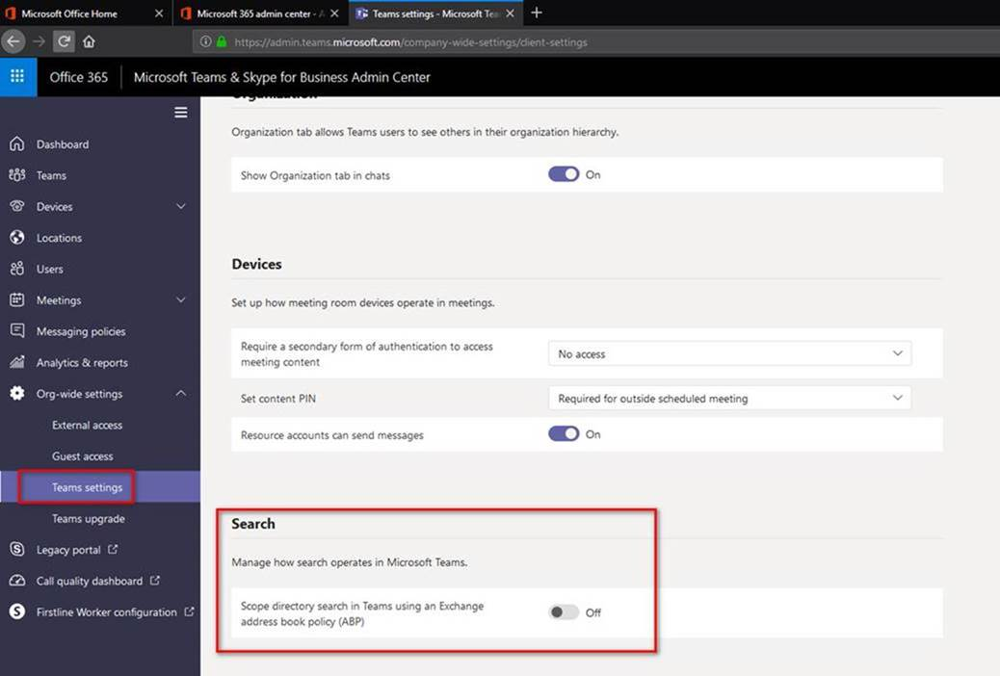

这次会议其实也是机缘巧合，在4月份上海的DevDays后，就有朋友加我微信。

考虑点是，可能他们有项目需要，后期有问题可以和我沟通。

跟上次相比，这次跑得好远，地铁多坐了十来站。

这次朋友公司邀请，其实还有另外两个讲java内存优化相关内容的，没有他们的大头像，上个合照算了[左边叫汤姆，右边叫克利克斯]

由于都感觉距离比较远，所以会议定在了下午一点半。

### Agenda

##### 13:50-14:20：负责人介绍了一下团队和主讲人，及会议日程。
##### 14:20-15:45：两位大佬讲java内存相关内容。
##### 15:45-16:00，自由讨论及问答沟通。
##### 16:00-17:30，Microsoft Graph和Teams开发。
##### 17:30-18:00，自由讨论和提问环节。
##### 18:30-19:30，和朋友及主讲人搓了一顿。

以上是大概的日程，顺序没问题，具体时间只做参考，因为过去蛮久了，记性差，谅解。

虽然不太懂java，但也顺便学习了一把，也算收获。

我主要跟大家讲了一下Graph基础知识，就留了一张图【捂脸】，是OAuth认证流程。

Graph相关的大家都不太了解，所以花了点时间讲解还有部分提问讨论内容。

后边流程讲Teams的实践其实并不多，只有半小时，也是加快语速讲完了。

### 问题1
有个童鞋提到了，之前遇到一个比较奇怪的问题，在后台已经添加认证访客的域名到白名单中，并且他在Teams里可以搜到此人（显示为外部），但是他的同事却搜不到此人，打全称也搜不到。

看了想相关设置，在这里修改下，帮他解决了。

其实还有一个点，就是
主要他们本地的AD也有这个用户但是后缀域不同，为了能跟国外同事沟通他们手动添加了国外的邮箱后缀 所以怎么也搜不到 或者说搜到了也无法加入团队。
让他在本地AD中将此人是外国邮箱信息删掉 在teams中就可以搜索 并添加为来宾了。

上边其实也是一个case，很多时候并不是系统本身的缺陷。

### 问题2
还有一个Teams使用者，在使用过程中，碰到的一个问题，teams预约会议，选择开始时间后，能优化下结束时间吗？默认往后推半小时？

这个，我们也不能解决，所以也及时提了产品的feedback，在后续更新中，希望能解决掉。

提问环节大家都很踊跃，可能Teams太有吸引力了，比较好玩，我也一一解答。