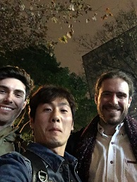
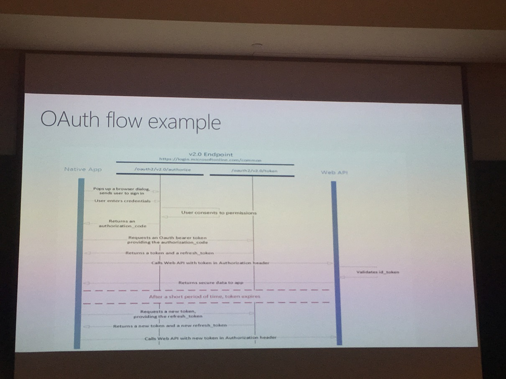

这次会议其实也是机缘巧合，在4月份上海的DevDays后，就有朋友加我微信。

考虑点是，可能他们有项目需要，后期有问题可以和我沟通。

跟上次相比，这次跑得好远，地铁多坐了十来站。

这次朋友公司邀请，其实还有另外两个讲java内存优化相关内容的，没有他们的大头像，上个合照算了[左边叫汤姆，右边叫克利克斯]

由于都感觉距离比较远，所以会议定在了下午一点半。

这样都可以睡个懒觉了，哈哈哈。

说是一点半，其实开始都两点差不多了。

### Agenda

##### 13:50-14:20：负责人介绍了一下团队和主讲人，及会议日程。
##### 14:20-15:45：两位大佬讲java内存相关内容。
##### 15:45-16:00，自由讨论及问答沟通。
##### 16:00-17:30，Microsoft Graph和Teams开发。
##### 17:30-18:00，自由讨论和提问环节。
##### 18:30-19:30，和朋友及主讲人搓了一顿。

以上是大概的日程，顺序没问题，具体时间只做参考，因为过去蛮久了，记性差，谅解。

虽然不太懂java，但也顺便学习了一把，也算收获。

我主要跟大家讲了一下Graph基础知识，就留了一张图【捂脸】，是OAuth认证流程。

Graph相关的大家都不太了解，所以花了点时间讲解还有部分提问讨论内容。

后边流程讲Teams的实践其实并不多，只有半小时，也是加快语速讲完了。

