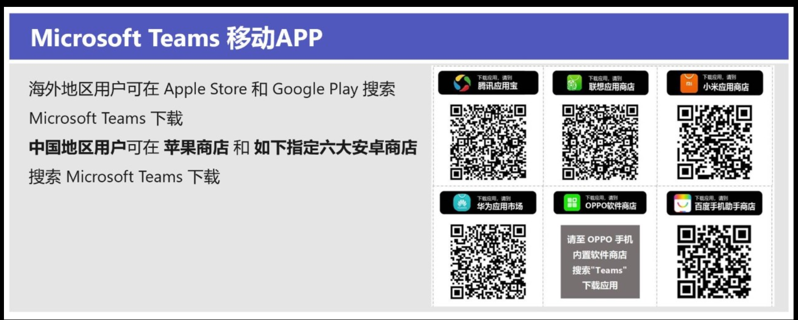
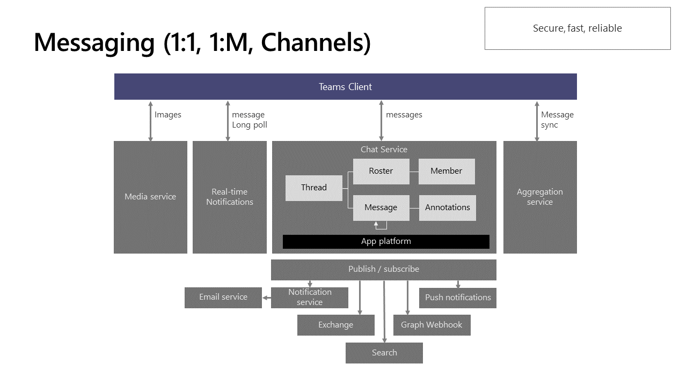
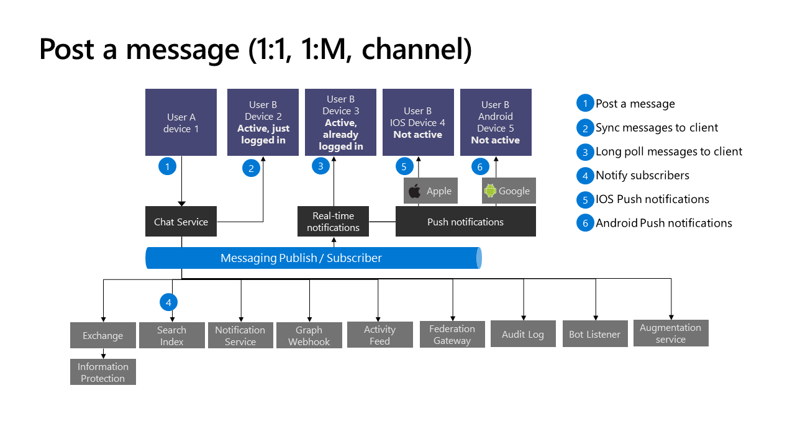

最近半年里，陆陆续续收到好几个朋友的请求，有两个是做协作软件这块的，另外也有不通行业做信息化办公的，他们自己本身的产品，除了Web还有移动应用。

这里就不对应用本身做赘述了。

想跟大家分享的是什么呢？除了这些产品设计方面的idea，还有开发方面的考虑，实现方案，当然最后主要讲的就是Teams，不然也不会找我，哈哈。

针对这几个月以来的技术分享，虽然主题都不一样，但是归类以下，主要有以下几个问题。

### **技术分享中主要的几个topic**

#### 协作软件怎么做，怎样才能做好用户体验

##### 其实这部分呢，见仁见智，但是最后都会拿同类产品的第一第二来对比，这样表明观点。所以这部分我就不展开讲了。

#### 大家对Slack和Teams的对比

##### 由于这部分是跟Teams相关的，我还有些许了解，所以这部分可以多说一点，稍微做个简单的分析。

* 会议  
  当提起会议解决方案，很多企业都会提到正在使用的Skype for Business和Microsoft Teams。
  微软Teams有超过329000个组织和企业正在使用. 在2018年, 微软就宣告Teams是目前音视频最完整的一套解决方案。

  随着Teams的发展，每年从Skype for Business产品迁移到Teams平台的企业数，会越来越多。

  Slack实际上是基于聊天的轻型会议，**没有**单独的会议功能。
* 真正的协作性  
  其实, 协作软件本身是为提高商业协作效率而生的，目前还没有主要的竞争对手，那么，是不是说Slack和Teams就有一场battle?

* 已经存在的方案
  也就是说，协作软件本身提供的扩展能力，Microsoft Teams当然是一个强大的平台，而不仅仅是一款协作产品。

除了以上内容，作为协作软件，其实message是核心。

那么在技术分享过程中，我也是讲这部分核心，还有Teams本身的扩展能力跟大家讲了一遍。

首先，但从message【或者叫conversation】，Teams有Conversation Bot。

### Conversation Bot

* 在团队里可以订阅聊天机器人的事件，比如说有人创建了一个频道，或者重命名频道，又或者说有人加入团队/离开团队，这些事件我们都是可以通过订阅，
让聊天机器人做一系列处理的。

* 群聊，at功能等。

* 主动推送消息。

* 发送或接受文件。
  这部分，其实在分享中有人问到真实的场景了。也是和机器人一对一聊天过程中的文件分享。

  两种途径可以做到  
   * Microsoft Graph APIs，这个支持个人/频道/群聊。  
     * 这个就是发送消息的时候，携带Card的Attachment，这个附件是引用现有SharePoint上的文件，同样是需要OAuth流程的。
   * Teams bot APIs，只支持个人的scope。
     * 支持的文件类型可以通过Manifest里的supportsFiles参数配置，要不要支持文件操作。

### Connectors和Webhook
  连接器这块，其实问的人比较少，我就简答做了个介绍，怎么跟外部系统打通，主要做notification相关的多一些。

### 被问到最多的信息收集和FAQ系统

  信息收集，大家的场景都类似，就是收集用户的form信息，这个其实Task Module可以做，但是很多人不知道流程。
  
  这个其实就是弹出来的一个modal，可以从bot里唤起，也可以在tab里调用Teams的JavaScript SDK来使用。

  js里的使用很多人也不太熟悉，其实比较简单。

  首先页面引入SDK，然后添加类似代码就ok了，具体可以参考官方文档：https://docs.microsoft.com/en-us/microsoftteams/platform/task-modules-and-cards/task-modules/task-modules-tabs#example-submitting-the-result-of-a-task-module
  ```javascript
  let taskInfo = {
    title: null,
    url: null
};

taskInfo.url = "{{yourdomain}}/customform";
taskInfo.title = "信息收集";
submitHandler = (err, result) => {
    // 这里是callback回来的数据和报错信息
    console.log(JSON.stringify(result));
};
// taskInfo描述展示的modal形态，submitHandler是点击save后的callback。
microsoftTeams.tasks.startTask(taskInfo, submitHandler);
  ```

### 自动问答/知识库系统 - Message Extension【消息扩展】

其实这里更多的场景就是知识库，或者KB系统。类似的场景都是机器人来做查询，再回应消息。

这部分功能用Message Extension其实就足够了，根据自己的业务场景再进行调整就好。

功能很好实现，但是有很多人对实现的原理还不是很了解，所以再这里也跟大家简单描述一下。

### 消息扩展原理

消息扩展主要由几部分组成，一个是我们自己的服务；另一个是manifest文件，这个清单文件里定义了我们的服务地址，这样Teams就能调用到。


然后，我们需要在Bot Framework里注册自己的服务为一个机器人。虽然我们可以纯手工打造，再造轮子，但是尽量使用Bot Framework SDK，这样会让开发变得很简单。

在应用的清单文件中，定义一个最多包含是个命令的消息扩展。

当然，目前只能有一个消息扩展，而且这个消息扩展最多只能有十个命令，这个限制可能在后
续会去掉，就看产品发展需求等情况了。

每一个命令定义一个消息类型，是基于行为呢，还是基于搜索呢？

还包含可以从Teams客户端哪里可以发起调用，也就是使用范围，compose message区域, 命令bar, 或者在message里)。

一旦被调用, 我们的服务会收到一个HTTPS的请求，请求是一串包含众多信息的JSON字符串， 我们再按照JSON的格式返回响应, 告诉Teams接下来应该做什么。

### 被问及到的问题

* 在安卓收集上，Teams的推送不及时或者是收不到
  这个问题，其实之前很多人问到过，其实是国内收集不能通过Google的推送服务，所以收不到提醒。

  后边已经将大陆上的应用更换了推送服务，不依赖谷歌的推送。但请从以下留个市场下载。
  

* 有人想了解消息的流程架构
  这个也有现成的官方说明和文档，大家貌似没有养成用搜索引擎的习惯，哈哈哈

  这里上一张图
  
  

当然，中间也有很多问题，也都讨论解决了。不免碰到我也不知道的问题，后边看其实蛮多已经在

Office的Feedback论坛里被提到了。所以，私下也让大家留意了对应的论坛。

如果大家有什么问题，可以在这里https://microsoftteams.uservoice.com/forums/555103-public去提建议哈。

以上就是凭着记忆，总结了一下过去半年的几次分享主要内容和问题。

也希望，后续有更多机会，跟更多的业务人员和开发者分享更多的关于Teams的内容。
