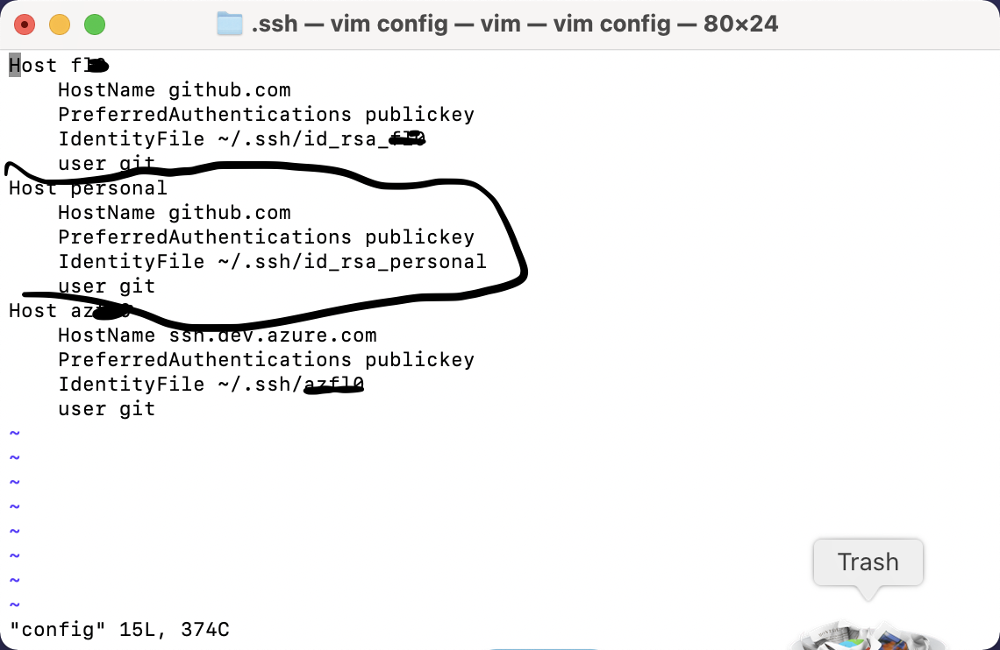

Note: Windows用户，Linux/Mac同理.

内容

* 生成多个SSH Key.
* 为github添加ssh key:
* 创建config文件
* 更新stored identities
* 测试

## 生成多个SSH Key

比如我有两个github账号，一个私人的，另一个是工作的。

创建两个SSH key, 各自保存对应的文件:
执行以下gitbash命令  
$ cd ~/.ssh  
$ ssh-keygen -t rsa -C "paul_chexxxxxg@msxx.cn"  
Note: 提示输入文件名的时候，保存为id_rsa_personal，passphrase一路为空跳过（也可以自己设置，为了方便我都置为空）  
$ ssh-keygen -t rsa -C "paul.k.xxxg@hxxxx.com"
Note: 提示输入文件名的时候，保存为id_rsa_work，同上passphrase。

以上命令会生成以下四个文件（两对儿rsa密钥）:  
id_rsa_personal  
id_rsa_personal.pub  
id_rsa_work  
id_rsa_work.pub

## 为github添加ssh key

拷贝.pub文件内容，并设置到自己的两个github账号上去，设置方法：  
进入GitHub账户的Settings页面 -> "SSH Keys" -> "Add SSH key":  
    1. 粘贴到Key字段  
    2. 起个名字  
    3. 提示输入密码，然后确认。  

两个github账号都使用以上方式。

## 创建config文件

创建配置文件来管理多个.ssh下的key  
[Mac]$ touch config // Windows上就是个config文件，不带后缀的，如果建个txt的文件，识别不了。  
用您自己喜欢的文本编辑器，内容如下：  

    #githubPersonal  
    Host personal     
        HostName github.com  
        User git  
        IdentityFile ~/.ssh/id_rsa_personal  

    #githubWork  
    Host work  
        HostName github.com  
        User git  
        IdentityFile ~/.ssh/id_rsa_work

## 更新stored identities

* 用Powershell初始化ssh-agent(这个貌似不是必须的，保证ssh-agent正常运行就ok了，更新完有必要的话重启一下)

        $Get-Service -Name ssh-agent | Set-Service -StartupType Manual

* 清除当前的stored identities:

        $ ssh-add -D

* 添加两个key:

        $ ssh-add id_rsa_personal
        $ ssh-add id_rsa_work

* 测试是否添加成功:
        
        $ ssh-add -l

* 测试ssh是否识别新添加的两个key:

        $ ssh -T personal
        Hi githubPersonal! You've successfully authenticated, but GitHub does not provide shell access.
        $ ssh -T work
        Hi githubWork! You've successfully authenticated, but GitHub does not provide shell access.

## 测试

这里需要注意的就是，在git操作remote的时候，地址不一样。  
我们用的是自定义账号git@personal或者git@work，而不是git@github.com.  
比如git@github.com:xxx/yyy.git变为git@work:xxx/yyy.git,   
或者git@github.com:mmm/nnn.git变为git@personal:xxx/yyy.git。

这里的work和personal对应config里的host。

2021/04/18 更新 For Mac
首先cd到～/.ssh路径下
1. 生成ssh的key pair(步骤略)，然后把pub key copy到对应server上（e.g. github portal上创建一个ssh key）
2. > vim config，如图

   ]
3. 测试，e.g. git clone git@github.com:paul-cheung/paul-cheung.github.io.git改为
   > git clone git@personal:paul-cheung/paul-cheung.github.io.git
   
[参考链接](https://dev.to/raven404/managing-multiple-github-account-using-git-in-windows-2m0h)
