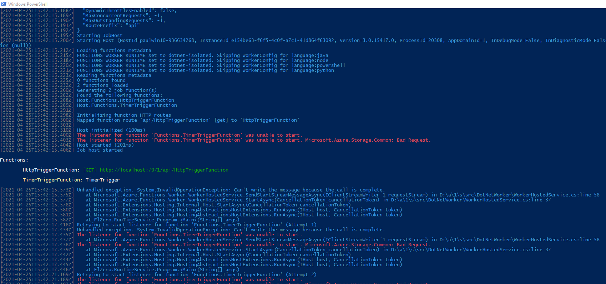
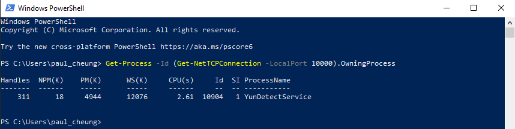
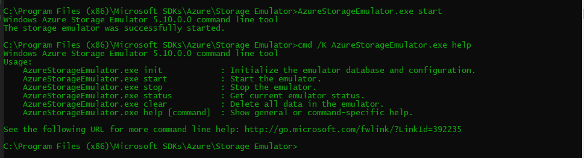

Note: 由于有将3.0/3.1版本的Azure Function升级到.NET 5的计划，所以本地尝试升级，并调试之。但发生一系列问题，其中一个就是TimerTrigger起不来（pre .NET 5版本没注意有没有这个要求）

内容

## 本地调试Azure Function (.NET 5)
今天在尝试本机跑.NET 5版本的Azure Function(参考文档https://codetraveler.io/2021/02/12/creating-azure-functions-using-net-5/)的时候，发现TimerTrigger起不来，现象：

搜索结果：TimerTrigger在本地run的时候会依赖Azure Storage Emulator。[参考链接](https://github.com/Azure/azure-functions-core-tools/issues/2058#issuecomment-649591406)

### 启动 Azure Storage Emulator
[查原因中参考链接](https://joeblogs.technology/2020/07/windows-azure-storage-emulator-error-unable-to-start-the-storage-emulator/)

然后查看端口占用情况，果然，由于装了百度云，所以YunDetectService占用了10000端口

随即kill掉这个process，再启动成功
